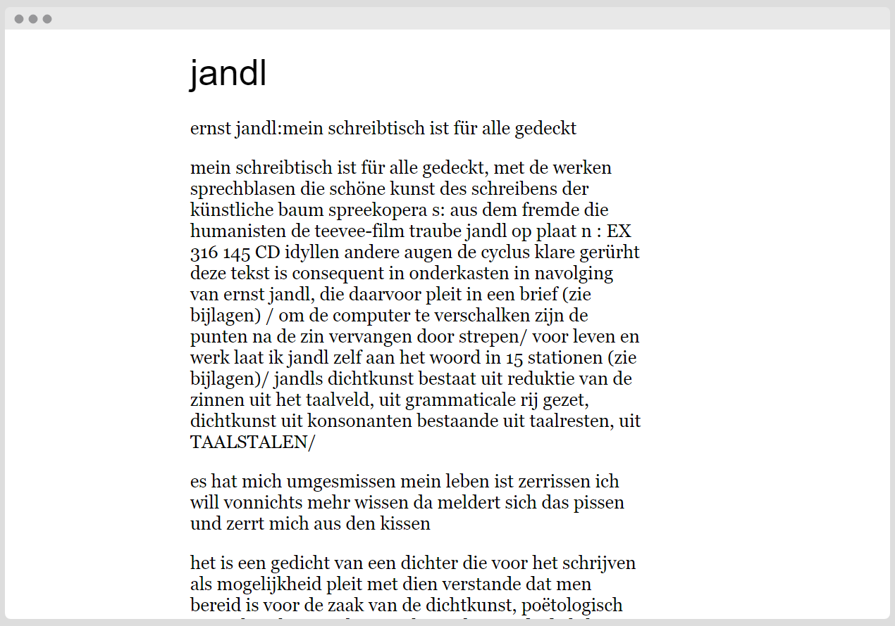
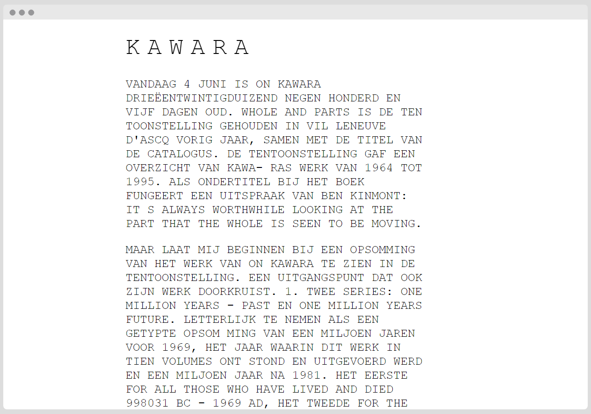
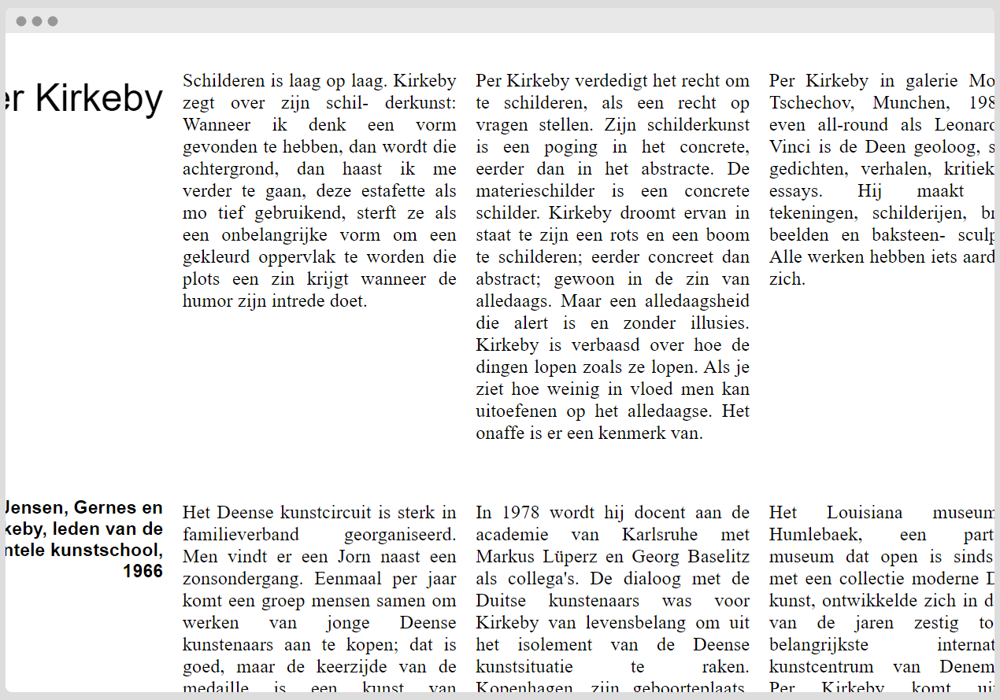
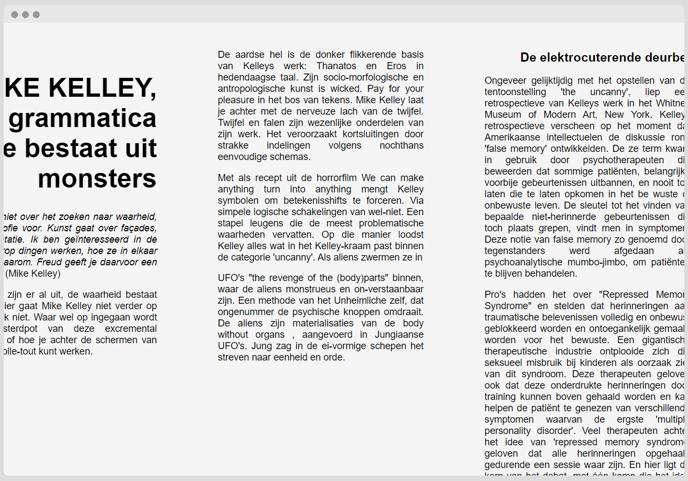

# Scripties

Collection of scripties on art and language. 

Lang: NL

## Published on tilde.club

- [jandl](https://tilde.club/~miccaman/scripties/kunst/jandl.html)
- [kawara](https://tilde.club/~miccaman/scripties/kunst/kawara.html)
- [kirkeby](https://tilde.club/~miccaman/scripties/kunst/kirkeby.html)
- [kelley](https://tilde.club/~miccaman/scripties/kunst/kelley.html)
- [hertmans](https://tilde.club/~miccaman/scripties/kunst/scriptieShertmans.html)






## Getting Started

These instructions will get you a copy of the project up and running on your local machine for development and testing purposes. 

### Installing

```
git clone git@github.com:tankred/scripties.git
```

## Versioning

We use [SemVer](http://semver.org/) for versioning. For the versions available, see the [tags on this repository](https://github.com/tankred/scripties/tags). 

## Authors

* **Tankred** - *Initial work* - [tankred](https://github.com/tankred)

## License

This project is licensed under the GNU General Public License v3.0 - see the [LICENSE](LICENSE) file for details

## Acknowledgments

* Hat tip to anyone whose code was used
* [Font Library](https://fontlibrary.org/en/font/open-sauce-two)
* [jrl.ninja](https://jrl.ninja/etc/1/)
* [A modern CSS reset](https://hankchizljaw.com/wrote/a-modern-css-reset/)
* How border-radius works: [8 point border radius](https://9elements.github.io/fancy-border-radius/full-control.html)
* [Shape Divider](https://www.shapedivider.app/)
* [Don't waste paper print css](https://printstylesheet.dbushell.com)

